**Created By:** Juan Yovian - 24911605

# 1. Introduction

# 2. Graph Database Design

## 2.1. Design Overview

The property graph consists of two node types and two relationship types.

##### Nodes

- `Airline` - representing a unique airline operation in the dataset. Each node stores the airline's `name` and `country` of ****registration as its properties.
- `Airport` - representing a unique airport. Each node stores the airport's `name`, `city`, and `country` as properties.

##### Relationships

- `OPERATES` - this relationship connects an `Airline` node to a departure `Airport` node, representing that the airline operates a route out of that airport. The `plane_name` property is stored on this relationship as it describes the aircraft used for that specific service, which cannot be attributed to either the airline or airport alone.
`ROUTE` - this relationship connects a departure `Airport` node to an arrival `Airport` node, representing that a direct connection exists between the two airports. This relationship carries no properties as it solely captures airport connectivity.

## 2.2. Arrows App Diagram

**Figure 1**. Graph Database Design

## 2.3. Design Choices and Discussion

##### 1. Not having a separate `Location` node

The dataset only provides city and country names as plain text values with no additional attributes such as continent, population, or country code. Creating a dedicated `Location` node would only add unnecessary complexity to the graph without providing meaningful additional value for querying.

Therefore, `country` was retained as a simple property on both `Airline` and `Airport` nodes. The downside is that location-based queries ****rely on property matching (ex: `WHERE a.country = 'Australia'`) rather than relationship traversal, which makes the graph looking very simple but functionally equivalent for the dataset.

#### 2. Having a separate `ROUTE` relationship instead of just `OPERATES`

`OPERATES` only connects `Airline -> Airport`. It will only tell us which airline flies out of which airport. But specifically for query `e` (flight between Beijing and Perth), we will need an `Airport -> Airport` relationship. Without `ROUTE`, Cypher won't be able to jump between airports directly. It would have to go through airline nodes every time.

##### 3. Putting `plane_name` property on `OPERATES`

`plane_name` is stored as a property on the `OPERATES` relationship as it is required for query `d`, which involves counting distinct aircraft types per airport pair. It is not store on `Airline` or `Airport` because it describes the specific service operated between an airline and an airport, and can't be meaningfully attributed to either entity independently.

# 3. ETL Process

## 3.1. Dataset Overview

### 3.1.1. Data description by columns

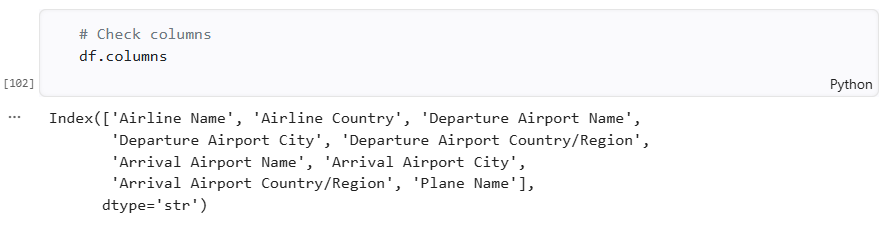
Based on the snippet above, we can see that the dataset contains information about airline routes and the aircraft used to operate them. Each row of the dataset represents a specific route that the airline operates on, detailing the departure and arrival airports, the country each airport is lcoated in, and the aircraft types used for that route. Additional information includes the country in whicih the airline is based and the city of each airport.

### 3.1.2. Data structure

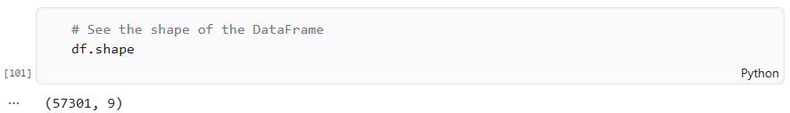

Based on the snippet above we can see that the dataset has 9 columns with 57,301rows of observations.

### 3.1.3. Immediate Observations

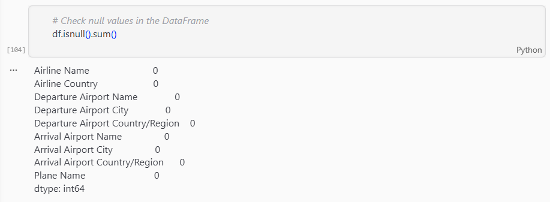

The dataset contains no `null` values. Which means all columns and all rows contains a value.

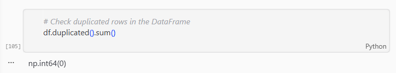

The dataset contains no duplicated rows, which means all records are unique.

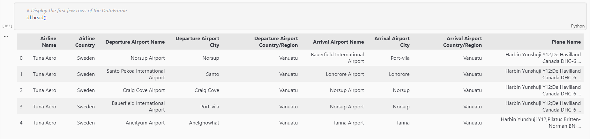Inspecting the first five rows reveals that the `Plane Name` column contains `;` values, indicating that a single route may be operated using multiple aircraft types. This would require special handling during ETL to correctly extract individual plane types for query `d`.

## 3.2. Data Cleaning

Based on the result of the initial inspections, the raw datasets are already clean of missing values and duplicates. However, additional cleaning checks were performed to ensure data consistency before generating the node and relationship CSVs.

### 3.2.1. Whitespace Check

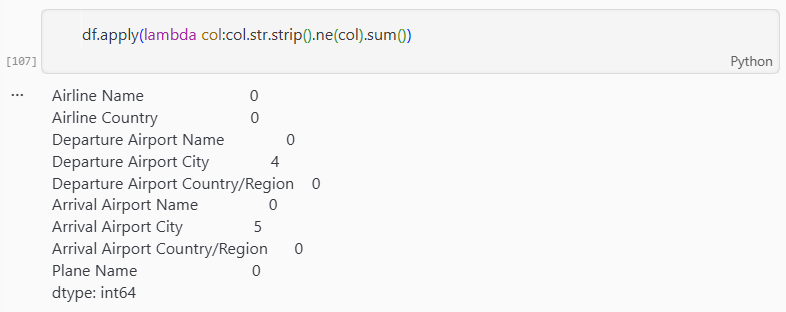

The whitespace check revealed that `Departure Airport City` and `Arrival Airport City` contained 4 and 5 values that contain leading or trailing whitespace respectively. These were then corrected by applying `str.strip()` to both columns.

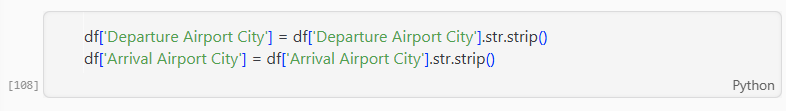

### 3.2.2. Case Inconsistencies Check

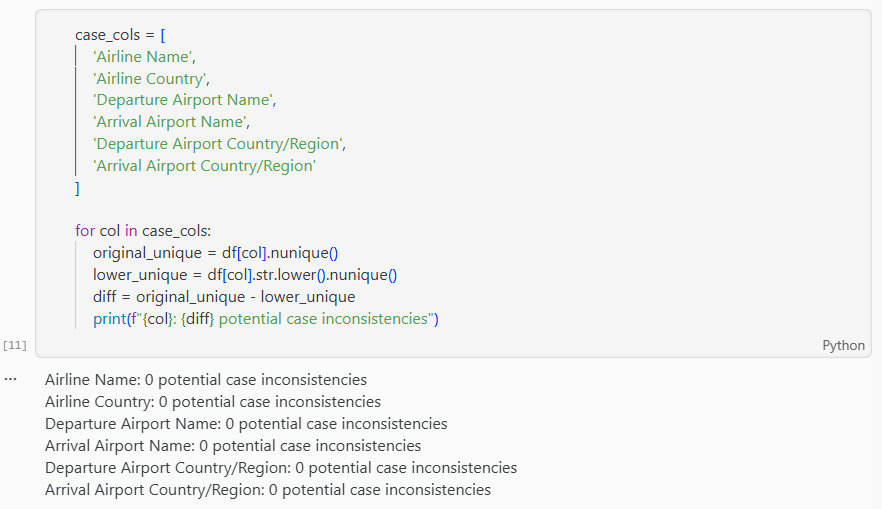

Case inconsistency checks on key columns such as `Airline Name`, `Airline Country`, `Departure Airport Name`, `Arrival Airport Name`, `Departure Airport Country/Region`, and `Arrival Airport Country/Region` resulted in no issues found. No further transformation was required.

With these cleaning steps done, the dataset was exported and ready to be used for node and relationship CSV generation.

## 3.3. Node CSV Generation

The nodes generated from the raw datasets are `Airlines` and `Airports`. Before the nodes were created, the previously cleaned dataset was read again.

### 3.3.1. `Airlines` Node

`Airlines` node was designed to have information about the airline's name and the country it is based in. With that, the columns used to build the node are `Airline Name` and `Airline Country`.

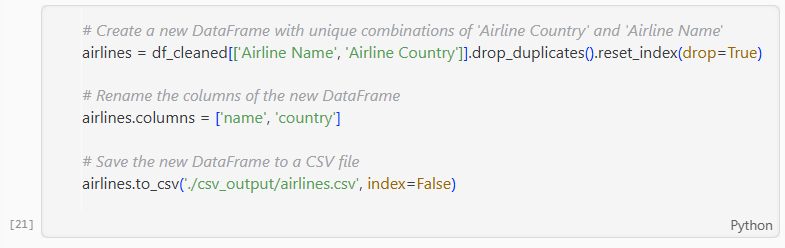

- `drop_duplicates()` is used to remove duplicates of `Airline Name-Airline Country` combination.
- `reset_index(drop=True)` is used to reset the sequential order after removing the duplicates. The `drop=True` ensures that the old index is discarded rather than added as an extra column.

### 3.3.2. `Airports` Node

`Airport` node was designed to have information of an airport's name and its geographical location, such as the city and country it's located in. In order to make sure we have all the airports in the dataset, we will be combining the departure airports and the arrival airports.

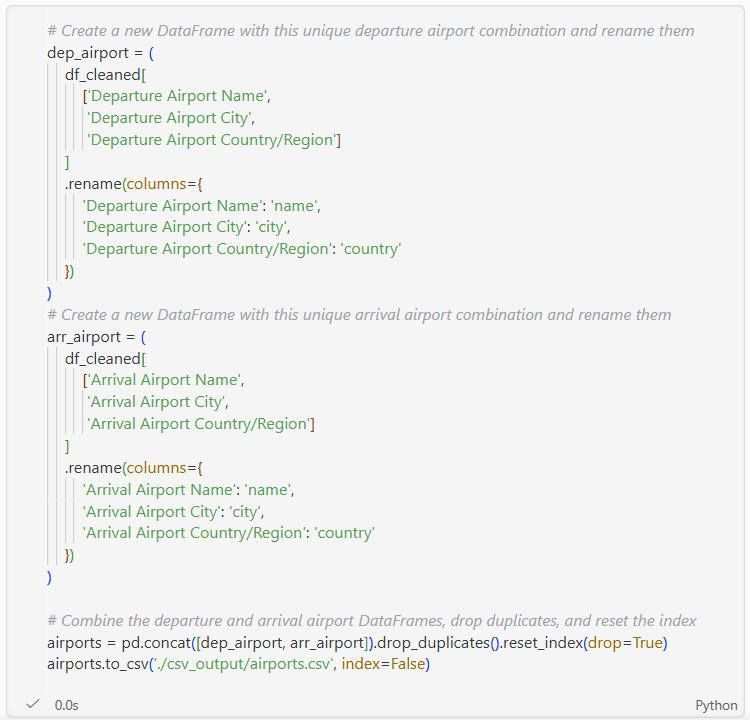

- `dep_airport` and `arr_airport` are created separately by extracting departure and arrival airport columns respectively, then renaming them to a consistent schema (name, city, country).
- `pd.concat()` combines both DataFrames into one since airports appear on both sides of the dataset. An airport can be a departure airport in one row and an arrival airport in another.
- `drop_duplicates()` ensures each unique airport only appears once in the final CSV.
- reset_index(drop=True) resets the index to a clean sequential
  order after concatenation and deduplication.

## 3.4. Relationship CSV Generation

The relationships developed from the raw dataset are: `ROUTES` and `OPERATES`.

### 3.4.1. `ROUTES` Relationship

`ROUTES` relationship was designed to capture the information about the route of a flight. From `Departure Airport Name` to `Arrival Airport Name`.

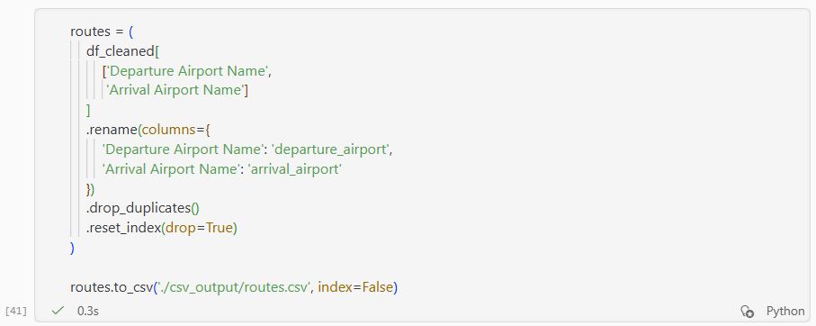

- `.drop_duplicates()` is used the resulting combinations of departure and arrival airports will have resulted in thousands of duplicated rows. This is because multiple airlines and planes can have the same flight routes.

### 3.4.2. `OPERATES` Relationship

`OPERATES` relationship was designed to contain information about the routes an airlines operates on and which of their planes are used for that specific service.

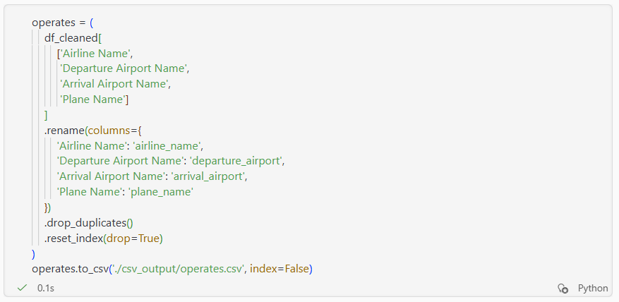

- `drop_duplicates()` removes duplicate airline-route-plane combinations since the same service can appear multiple times in the raw dataset.
- `plane_name` is retained as it is required for query `d`, which involves counting distinct aircraft types per airport pair.

# 4. Graph Database Implementation

## 4.1. Neo4j Import and Load CSV

### 4.1.1. Import SV

The generated CSV filese were copied into Neo4j `import` directory located at the Path shown in the picture below. Neo4j requires the files to be placed in the designated folder in order to be accessed by Cypher.

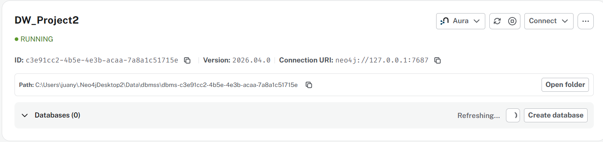

### 4.1.2 Load CSV

Below are the Cypher commands to load the CSVs for the nodes and relationships:

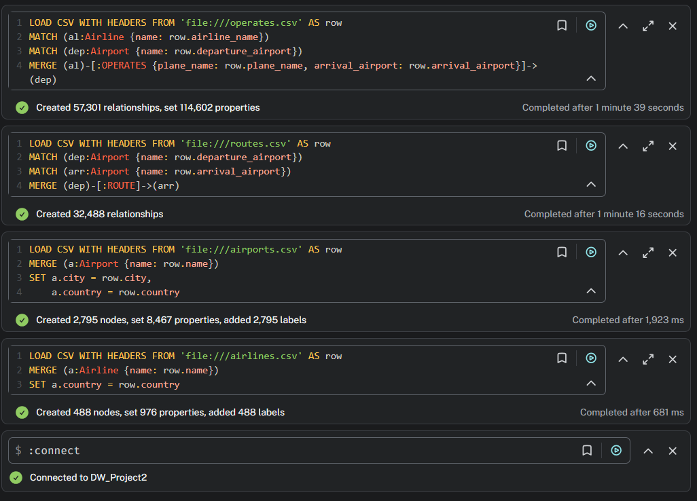

The `LOAD CSV WITH HEADERS` was used to load the CSVs, which reads each row of a CSV file and maps the values to node properties or relationship attributes.

`MERGE` was used instead of `CREATE` when importing nodes to prevent duplicate nodes from being created. `CREATE` inserts a new node regardless of whether it already exists, whereas `MERGE` will check first if a node with the specified properties already exist in the database. If it does, it matches the existing one. If it doesn't it creates a new one.

## 4.2. Database Statistics

After importing and loading the CSV files for the nodes and realtionships, the graph database was verified to contain the expected the number of nodes and relationships. As shown in the screenshots below, the database contains 2,783 nodes across the two labels, with 488 nodes for `Airline` and 2,795 nodes for `Airport`, and 89,789 relationships across two types, with 47,301 for `OPERATES` and 32,488 for `ROUTE`

###### Node

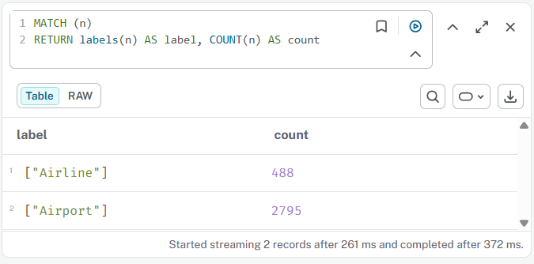

###### Relationship

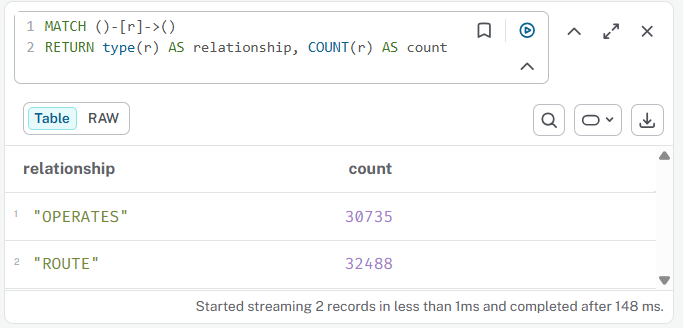

# 5. Cypher Queries

In this section, we will be writing the Cypher queries to answer the given 6 queries.

## 5.1. Query 1

> List all distinct airline names where the airline's country is Australia

The first query requires us to find the distinct names of the airlines where the country they're based in is Austalia

##### Query:

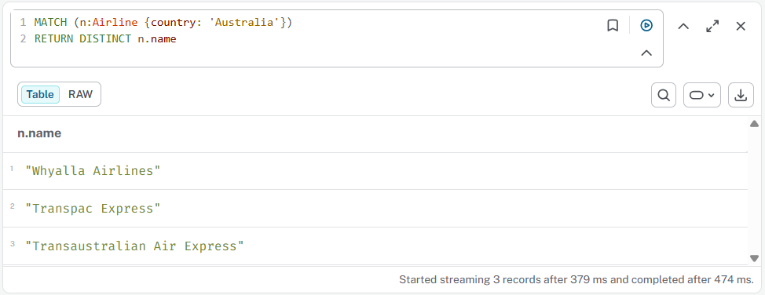

This query matches all `Airline` nodes where the `country` property is `Australia` and returns their distinct names. The result returned 3 Australian airlines:

- Whyalla Airlines
- Transpac Express
- Transaustralian Air Express

## 5.2. Query 2

> "How many route records are domestic, and how many are international? A route is domestic if the departure and arrival airports are in the same country/region."

### 5.2.1. Domestic Routes

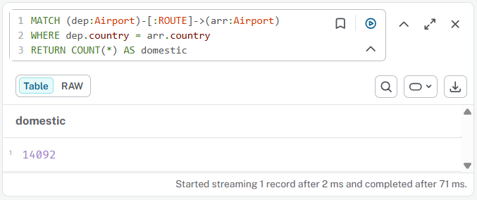

This query traverses the `ROUTE` relationship between two `Airport` nodes. Since each `Airport` node stores a `country` property, we can compare the departure and arrival airport countries diectly.

`WHERE dep.country = arr.country` filters the result to show only domestic routes, which returned **14,092 routes**.

### 5.2.2. International Routes

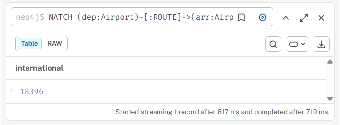

This query traverses the `ROUTE` relationship between two `Airport` nodes. Since each `Airport` node stores a `country` property, we can compare the departure and arrival airport countries diectly.

WHERE dep.country <> arr.country` filters the result to show only international routes, which returned **18,396 routes**.

## 5.3. Query 3

## 5.4. Query 4

## 5.5. Query 5

## 5.6. Query 6

# 6. Self-Designed Queries

## 6.1. Self Query 1

## 6.2. Self Query 2

# 7. Graph Data Science Application

# 8. References

# 9. Appendix - AI Usage
