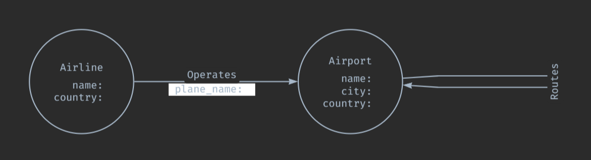

**Created By:** Juan Yovian - 24911605

# 1. Introduction
  

# 2. Graph Database Design
## 2.1. Design Overview
The property graph consists of two node types and two relationship types.
##### Nodes
- `Airline` - representing a unique airline operation in the dataset. Each node stores the airline's `name` and `country` of registration as its properties.
- `Airport` - representing a unique airport. Each node stores the airport's `name`, `city`, and `country` as properties.
##### Relationships
- `OPERATES` - this relationship connects an `Airline` node to a departure `Airport` node, representing that the airline operates a route out of that airport. The `plane_name` property is stored on this relationship as it describes the aircraft used for that specific service, which cannot be attributed to either the airline or airport alone.
- `ROUTE` - this relationship connects a departure `Airport` node to an arrival `Airport` node, representing that a direct connection exists between the two airports. This relationship carries no properties as it solely captures airport connectivity.

## 2.2. Arrows App Diagram

**Figure 1**. Graph Database Design
## 2.3. Design Choices and Discussion
##### 1. Not having a separate `Location` node
The dataset only provides city and country names as plain text values with no additional attributes such as continent, population, or country code. Creating a dedicated `Location` node would only add unnecessary complexity to the graph without providing meaningful additional value for querying.

Therefore, `country` was retained as a simple property on both `Airline` and `Airport` nodes. The downside is that location-based queries rely on property matching (ex: `WHERE a.country = 'Australia'`) rather than relationship traversal, which makes the graph looking very simple but functionally equivalent for the dataset.
##### 2. Having a separate `ROUTE` relationship instead of just `OPERATES`
`OPERATES` only connects `Airline -> Airport`. It will only tell us which airline flies out of which airport. But specifically for query `e` (flight between Beijing and Perth), we will need an `Airport -> Airport` relationship. Without `ROUTE`, Cypher won't be able to jump between airports directly. It would have to go through airline nodes every time.
##### 3. Putting `plane_name` property on `OPERATES`
`plane_name` is stored as a property on the `OPERATES` relationship as it is required for query `d`, which involves counting distinct aircraft types per airport pair. It is not store on `Airline` or `Airport` because it describes the specific service operated between an airline and an airport, and can't be meaningfully attributed to either entity independently.

# 3. ETL Process
## 3.1. Dataset Overview

## 3.2. Data Cleaning

## 3.3. Node CSV Generation

## 3.4. Relationship CSV Generation

  

# 4. Graph Database Implementation

## 4.1. Neo4j Import

## 4.2. Database Statistics

  

# 5. Cypher Queries

## 5.1. Query 1

## 5.2. Query 2

## 5.3. Query 3

## 5.4. Query 4

## 5.5. Query 5

## 5.6. Query 6

  

# 6. Self-Designed Queries

## 6.1. Self Query 1

## 6.2. Self Query 2

  

# 7. Graph Data Science Application

  

# 8. References

  

# 9. Appendix - AI Usage