**Created By:** Juan Yovian - 24911605

# 1. Introduction

This report documents the design and implementation of a graph database for analyzing global airline route data, completed as Project 2 for CITS5504 Data Warehousing.

This project covers:

- the design of property graph using the Arrows App,
- the ETL process to clean and transform raw dataset into nodes and relationship CSVs using Python and pandas,
- the implementation of graph database in Neo4j,
- and the executions of Cypher queries to answer specific business questions about airline operations and airport connectivity.

This report also includes self-designed queries demonstrating the use of APOC procedures, and a discussion of how Graph Data Science algorithms could be applied to derive further insights

# 2. Graph Database Design

## 2.1. Design Overview

The property graph consists of two node types and two relationship types.

##### Nodes

- `Airline` - representing a unique airline operation in the dataset. Each node stores the airline's `name` and `country` of registration as its properties.
- `Airport` - representing a unique airport. Each node stores the airport's `name`, `city`, and `country` as properties.

##### Relationships

- `OPERATES` - this relationship connects an `Airline` node to a departure `Airport` node, representing that the airline operates a route out of that airport. The `plane_name` property is stored on this relationship as it describes the aircraft used for that specific service, which cannot be attributed to either the airline or airport alone.
- `ROUTE` - this relationship connects a departure `Airport` node to an arrival `Airport` node, representing that a direct connection exists between the two airports. This relationship carries no properties as it solely captures airport connectivity.

## 2.2. Arrows App Diagram

## 2.3. Design Choices and Discussion

##### 1. Not having a separate `Location` node

The dataset only provides city and country names as plain text values with no additional attributes such as continent, population, or country code. Creating a dedicated `Location` node would only add unnecessary complexity to the graph without providing meaningful additional value for querying.

Therefore, `country` was retained as a simple property on both `Airline` and `Airport` nodes. The downside is that location-based queries rely on property matching (ex: `WHERE a.country = 'Australia'`) rather than relationship traversal, which makes the graph looking very simple but functionally equivalent for the dataset.

##### 2. Having a separate `ROUTE` relationship instead of just `OPERATES`

`OPERATES` only connects `Airline -> Airport`. It will only tell us which airline flies out of which airport. But specifically for query `e` (flight between Beijing and Perth), we will need an `Airport -> Airport` relationship. Without `ROUTE`, Cypher won't be able to jump between airports directly. It would have to go through airline nodes every time.

##### 3. Putting `plane_name` property on `OPERATES`

`plane_name` is stored as a property on the `OPERATES` relationship as it is required for query `d`, which involves counting distinct aircraft types per airport pair. It is not store on `Airline` or `Airport` because it describes the specific service operated between an airline and an airport, and can't be meaningfully attributed to either entity independently.

# 3. ETL Process

## 3.1. Dataset Overview

### 3.1.1. Data description by columns

Based on the snippet above, we can see that the dataset contains information about airline routes and the aircraft used to operate them. Each row of the dataset represents a specific route that the airline operates on, detailing the departure and arrival airports, the country each airport is lcoated in, and the aircraft types used for that route. Additional information includes the country in whicih the airline is based and the city of each airport.

### 3.1.2. Data structure

Based on the snippet above we can see that the dataset has 9 columns with 57,301rows of observations.

### 3.1.3. Immediate Observations

The dataset contains no `null` values. Which means all columns and all rows contains a value.

The dataset contains no duplicated rows, which means all records are unique.

Inspecting the first five rows reveals that the `Plane Name` column contains `;` values, indicating that a single route may be operated using multiple aircraft types. This would require special handling during ETL to correctly extract individual plane types for query `d`.

## 3.2. Data Cleaning

Based on the result of the initial inspections, the raw datasets are already clean of missing values and duplicates. However, additional cleaning checks were performed to ensure data consistency before generating the node and relationship CSVs.

### 3.2.1. Whitespace Check

The whitespace check revealed that `Departure Airport City` and `Arrival Airport City` contained 4 and 5 values that contain leading or trailing whitespace respectively. These were then corrected by applying `str.strip()` to both columns.

### 3.2.2. Case Inconsistencies Check

Case inconsistency checks on key columns such as `Airline Name`, `Airline Country`, `Departure Airport Name`, `Arrival Airport Name`, `Departure Airport Country/Region`, and `Arrival Airport Country/Region` resulted in no issues found. No further transformation was required.

With these cleaning steps done, the dataset was exported and ready to be used for node and relationship CSV generation.

## 3.3. Node CSV Generation

The nodes generated from the raw datasets are `Airlines` and `Airports`. Before the nodes were created, the previously cleaned dataset was read again.

### 3.3.1. `Airlines` Node

`Airlines` node was designed to have information about the airline's name and the country it is based in. With that, the columns used to build the node are `Airline Name` and `Airline Country`.

- `drop_duplicates()` is used to remove duplicates of `Airline Name-Airline Country` combination.
- `reset_index(drop=True)` is used to reset the sequential order after removing the duplicates. The `drop=True` ensures that the old index is discarded rather than added as an extra column.

### 3.3.2. `Airports` Node

`Airport` node was designed to have information of an airport's name and its geographical location, such as the city and country it's located in. In order to make sure we have all the airports in the dataset, we will be combining the departure airports and the arrival airports.

- `dep_airport` and `arr_airport` are created separately by extracting departure and arrival airport columns respectively, then renaming them to a consistent schema (name, city, country).
- `pd.concat()` combines both DataFrames into one since airports appear on both sides of the dataset. An airport can be a departure airport in one row and an arrival airport in another.
- `drop_duplicates()` ensures each unique airport only appears once in the final CSV.
- reset_index(drop=True) resets the index to a clean sequential
  order after concatenation and deduplication.

## 3.4. Relationship CSV Generation

The relationships developed from the raw dataset are: `ROUTES` and `OPERATES`.

### 3.4.1. `ROUTES` Relationship

`ROUTES` relationship was designed to capture the information about the route of a flight. From `Departure Airport Name` to `Arrival Airport Name`.

- `.drop_duplicates()` is used the resulting combinations of departure and arrival airports will have resulted in thousands of duplicated rows. This is because multiple airlines and planes can have the same flight routes.

### 3.4.2. `OPERATES` Relationship

`OPERATES` relationship was designed to contain information about the routes an airlines operates on and which of their planes are used for that specific service.

- `drop_duplicates()` removes duplicate airline-route-plane combinations since the same service can appear multiple times in the raw dataset.
- `plane_name` is retained as it is required for query `d`, which involves counting distinct aircraft types per airport pair.

# 4. Graph Database Implementation

## 4.1. Neo4j Import and Load CSV

### 4.1.1. Import CSV

The generated CSV filese were copied into Neo4j `import` directory located at the Path shown in the picture below. Neo4j requires the files to be placed in the designated folder in order to be accessed by Cypher.

### 4.1.2 Load CSV

Below are the Cypher commands to load the CSVs for the nodes and relationships:

###### `Airlines` Node

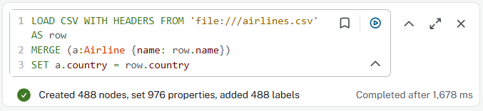

###### `Airports` Node

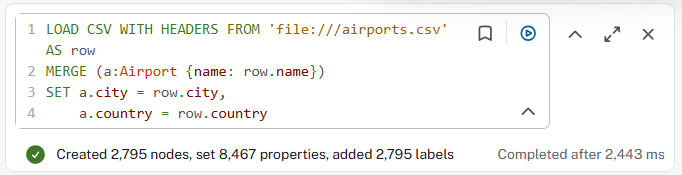

###### `ROUTE` Relationship

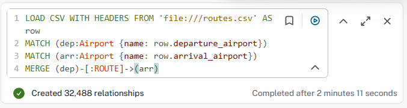

###### `OPERATES` Relationship

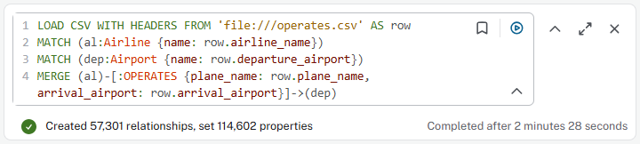

The `LOAD CSV WITH HEADERS` was used to load the CSVs, which reads each row of a CSV file and maps the values to node properties or relationship attributes.

`MERGE` was used instead of `CREATE` when importing nodes to prevent duplicate nodes from being created. `CREATE` inserts a new node regardless of whether it already exists, whereas `MERGE` will check first if a node with the specified properties already exist in the database. If it does, it matches the existing one. If it doesn't it creates a new one.

## 4.2. Database Statistics

After importing and loading the CSV files for the nodes and realtionships, the graph database was verified to contain the expected the number of nodes and relationships. As shown in the screenshots below, the database contains 3,283 nodes across the two labels, with 488 nodes for `Airline` and 2,795 nodes for `Airport`, and 89,789 relationships across two types, with 57,301 for `OPERATES` and 32,488 for `ROUTE`

###### Node

###### Relationship

# 5. Cypher Queries

In this section, we will be writing the Cypher queries to answer the given 6 queries.

## 5.1. Query A

> List all distinct airline names where the airline's country is Australia

The first query requires us to find the distinct names of the airlines where the country they're based in is Austalia

This query matches all `Airline` nodes where the `country` property is `Australia` and returns their distinct names. The result returned 3 Australian airlines:

- Whyalla Airlines
- Transpac Express
- Transaustralian Air Express

## 5.2. Query B

> "How many route records are domestic, and how many are international? A route is domestic if the departure and arrival airports are in the same country/region."

### 5.2.1. Domestic Routes

This query traverses the `ROUTE` relationship between two `Airport` nodes. Since each `Airport` node stores a `country` property, we can compare the departure and arrival airport countries diectly.

`WHERE dep.country = arr.country` filters the result to show only domestic routes, which returned **14,092 routes**.

### 5.2.2. International Routes

This query traverses the `ROUTE` relationship between two `Airport` nodes. Since each `Airport` node stores a `country` property, we can compare the departure and arrival airport countries diectly.

`WHERE dep.country <> arr.country` filters the result to show only international routes, which returned **18,396 routes**.

## 5.3. Query C

> "Find the airport pair with the greatest number of records. Treat A→B and B→A as the same airport pair."

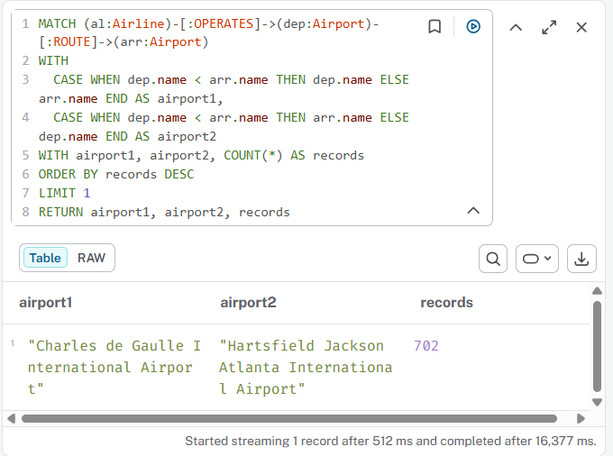

This query traverses the path from `Airline` to departure airport via the`OPERATES` relationship, then connects to arrival airport via the `ROUTE` relationship. This query uses the `WITH` query to chain multiple queries together.

The `CASE WHEN` query compares the two airport names alphabetically, then put the "smaller" name as `airport1` and the larger one as `airport2`. This ensures that Route `Perth -> Sydney` will always give the same result as `Sydney -> Perth`. `airport1` will be Perth and `airport2` will be Sydney.

The results are grouped into `airport1`, `airport2`, and `records` that counts all occurences, then have only the first record shown, which would have the highest number of records. In this case, it is the route between **Charles de Gaulle International Airport and Hartsfield Jackson Atlanta International Airport** with **702 records** .

## 5.4. Query D

> Find the top 5 airport pairs that are served with the greatest number of distinct aircraft types across all rows and all airlines. Treat A→B and B→A as the same airport pair, and count distinct aircraft types across all rows for that pair.

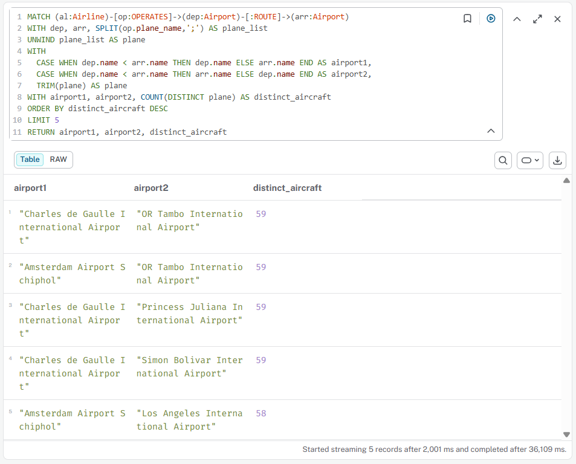

This query traverses the path from `Airline` to departure airport, via the `OPERATES` relationship, to arrival airport, via the `ROUTE` relationship. Plane information is stored in `OPERATES`, so we will access it and use `SPLIT` to turn them into a list, separated by `;`.  `UNWIND` was then used to turn each list elements as its own row, duplicating the other columns.

Like the previous query, `CASE WHEN` was used to ensure routes `A -> B` is treated the same as `B -> A`. `TRIM(plane)` to remove any trailing white spaces from the plane list.

Finally, we set the columns, and used `COUNT(DISTINCT plane)` to count unique values and then count the number plane types for each airport pair. This will return a number, which we will then sort `DESC` and take the top 5 result.

## 5.5. Query E

> Find all possible travel routes from Beijing Capital International Airport to Perth International Airport where at most 3 hops (at most 3 ROUTE relationships) are traversed. How many such distinct routes exist?

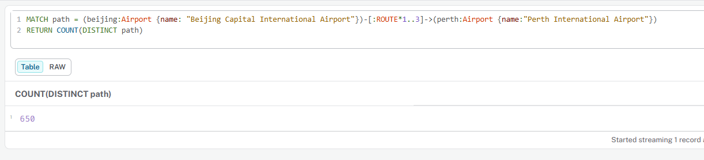

This query uses a varying-length path traversal to find all possible routes between Beijing Capital International Airport and Perth International Airport. `[:ROUTE*1..3]` instructs neo4j to follow up to 3 `ROUTE` relationships to reach the destination. Each unique sequence of airports visited is treated as a distinct route. The query returned **650 distinct routes**.

## 5.6. Query F

> Find the top 5 pairs of airlines that compete head-to-head on the greatest number of shared routes. Two airlines are considered competitors if they both operate between the same two airports, regardless of direction. Return the airline pair names and the number of routes they share.

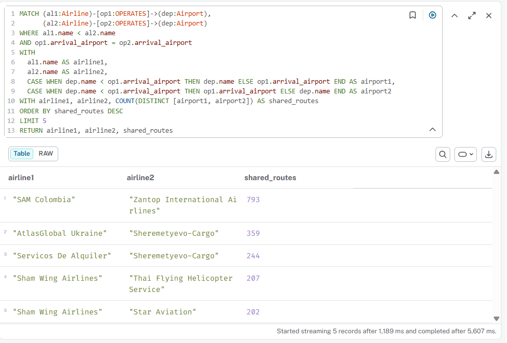

This query identifies the top 5 pairs of competing airlines based on the number of shared routes. SAM Colombia and Zantop International Airlines has the lead, with 793 shared routes, significantly more than the second through fifth pairs. Sham Wing Airlines and Sheremetyevo-Cargo each appear twice in the top 5, indicating that they are highly competitive carriers operating across many shared routes with multiple airlines.

# 6. Self-Designed Queries

## 6.1. Self Query 1

> Which airport has the most IN and OUT `ROUTE` relationships?

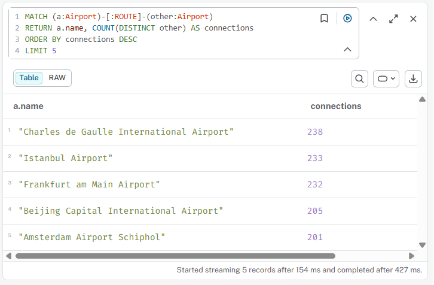

This self query was designed to find which airport has the most connections with other airports, both incoming and outgoing routes. The undirected relationship pattern `-[:ROUTE]-` traverses the `ROUTE` relationship in both directions, making sure an airport is counted regardless of whether it's the departure or arrival airport. `COUNT(DISTINCT other)` makes sure each connected airport is only counted once.

Based on this query, **Charles de Gaulle International Airport** has the most connections with other aiports at **238 connections**, with **Istanbul Airport**and **Frankfurt am Main Airport** coming in close behind at both above 230 connections.

## 6.2. Self Query 2

> Find the numebr of distinct flight paths originating from Perth International Airport within 1 to 3 hops, categorized by domestic (paths that stay within Australia) and international (paths tha pass through at least one non-Australian airport).

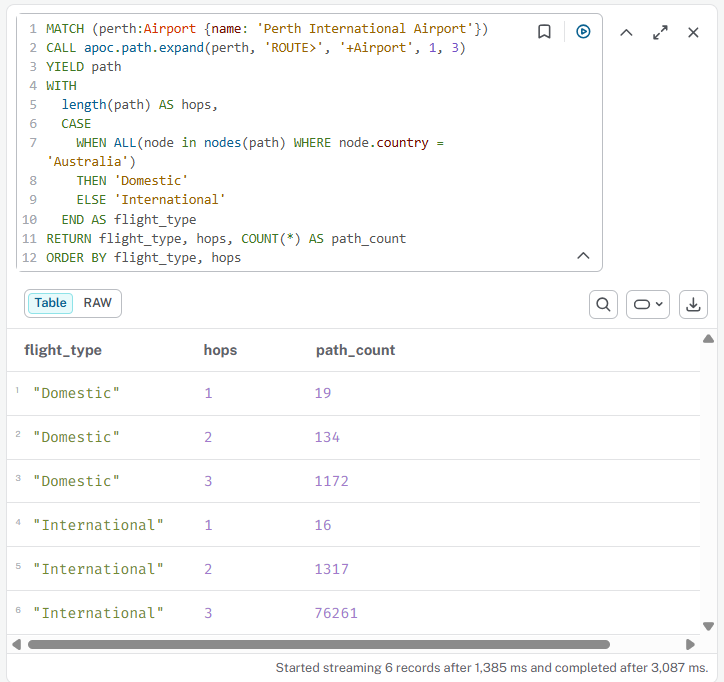

This query uses APOC's `apoc.path.expand` to do advanced path traversal from Perth International Airport. This method takes:

- the start node,
- a relationship filter (`ROUTE>` for outgoing ROUTE relationships),
- a label filter (`+Airport` to whitelist Airport node),
- and a minimum and maximum hop range (1 to 3)

The `YIELD path` clause captures every path found.

A `CASE WHEN ALL(...)` expression the categorizes each path. If all airports along the path are in Austrlia, the path is classified as `Domestic`, otherwise it will be `International`. The query groups by `flight_type` and `hops` to count the number of paths in each category.

**Result:**

This result shows a clear contrast between domestic and international connectivity from Perth. Direct flights (1 hop) include 19 domestic and 16 international destinations. This indicates Perth's role as a major Australian gateway. At 2 hops, international paths grow signficantly to 134 domestic and 1,317 international, reflecting Perth's strong global reach. At 3 hops, international paths become 1,172 domestic and 76,261 international, which could be the result of compounding network effects through major global transits such as Singapore, Dubai, and Doha.

# 7. Graph Data Science Application

## 7.1. Application: Identifying Strategic Hub Airports

A practical application of this airline graph database is the identification of strategically important airports within the global air transport network. Airlines, airport authorities, and aviation regulators frequently need to assess which airports play the most critical in the network based on volume of flights and by how essential the airports are to overall connectivity. Identifying these hubs can support the people responsible in makin decisions around infrastructure investment, route planning, security prioritization, and disruption analysis [1].

## 7.2. Algorithm: PageRank

The most suitable algorithm for hub identification is **PageRank**. Originally developed by Larry Page and Sergey Brin to rank Google search results [2]. The main idea is that a node (an airport) is considered important if many *other important nodes* connect to it. So an airport isn't just ranked by how many flights it receives but by *who* it receives flights from.

If we apply this algorithm to the airline graph, each `Airport` would be a node and each `ROUTE` relationship would be a directed edge. The algorithm would then calculate a score for every airport based on the number and importance of incoming routes. An airport that receives flights from many big hubs would score higher than airport that receives the same number of flights from small regional airports.

This is more useful than just counting connections, which is what the self-designed query in this report did. For example, there might be two airports that both have 100 incoming flights, but one of them was connected to major global airports while the other is connected to small regional airports. **PageRank captures this difference by weighing the importance of connections, not just counting them**.

In summary, PageRank fits airline networks well because:

- Flights have a clear direction (departure -> arrival) which the algorithm uses
- Being connected to a major hub matters more than being connected to a small airport
- It scales well to large networks with thousands of airports [3]

## 7.3. Other Suitable Algorithms

Other graph algorithms relevant to airline networks include:

* **Betweenness Centrality**
  Measures how often an airport appears on the shortest path between other airports. Airports with high scores act as critical connectors, meaning if they were removed (for example, due to closure or disruption), many travel routes would be affected. This is useful for identifying which airports are essential for keeping the network connected [4].
* **Community Detection (Louvain Algorithm)**
  Groups airports into clusters based on how densely they are connected to each other. These clusters often match real-world patterns like regional networks or airline alliances. This is useful for understanding which airports operate as a "group" and can support decisions around partnerships or regional route planning [5].
* **Shortest Path (Dijkstra's Algorithm)**
  Finds the most efficient route between two airports based on a chosen factor like distance, flight time, or cost. This is useful for travellers looking for the best connection options, or for airlines trying to plan optimal routing [6]

# 8. Metadata

To obtain our data's metadata, we can use `db.schema.visualiziation()` to see what our data looks like.

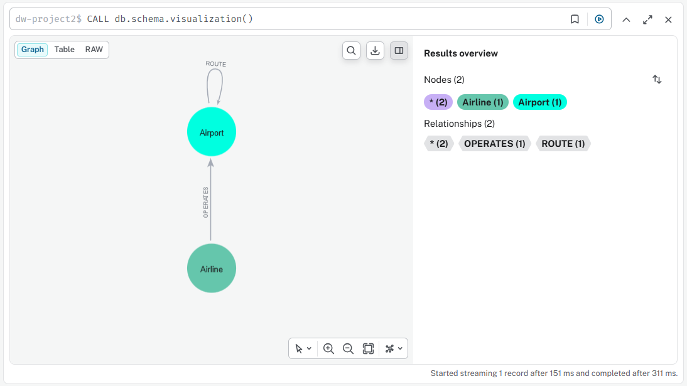

As we can see, the graph produced by Neo4J mirrors the graph database design using Arrows app back in section 2. There are 2 nodes and 2 relationships. The nodes are `Airline` and `Airport`, and the relationships are `OPERATES` and `ROUTE`. All airlines in the database are represented as one of the `Airline` node. All airports in the database are represented as one of the `Airport` nodes.

###### Nodes:

- `Airline` - all airlines are represented as one of this node
- `Airport` - all airport are represented as one of this node

###### Relationship:

- `OPERATES`- connects Airline to Airport, describing "this airlines operates on this airport"
- `ROUTE` - self-loop, describing connection between one airport with another

## 8.1. Why is metadata important when designing?

Metadata refers to the structural information the database maintains about itself, like node labels, relationship types, property keys, indexes, and constraints. Every label and property created during the ETL process is automatically registered as metadata. There are three points that explains why metadata is an important consdieration during design:

### 1. Determines what questions can be asked and answered

What we decide to put on which node or relationship shapes the questions we can answer. In the project, putting `plane_name` on `OPERATES` (instead of `Airline`) is what made query D possible, since aircraft type varies per route.

Having `ROUTE` as a separate relationship also made query E's variable-length path `[:ROUTE*1..3]` possible. Without it, cypher wouldn't be able to jump airport-to-airport directly.

### 2. Supports performance and integrity through indexes and constraints

Indexes and constraints are also parth of the metadata layer. An index on `Airport.name` lets `MATCH (a:Airport {name:...}` find an airport instantly instead of scanning thousands of node. This helps answering queries C, D, E, and F where airport-name lookups dominate.

### 3. Metada acts as documentation

Once a graph is implemented, the metadata becomes its documentaiton. Running `CALL db.schema.visualization()` produces an image of the structure, as shown above, allowing anyone joining the project to understand the graph's design without reading the entire ETL pipeline.

## 8.2. How Metadata Leverages Developers

Once the database is populated, its metadata becomes a tool for writing more effective and efficient queries. Neo4j provides built-in procedures and the APOC library for inspecting the live schema, which is useful for understanding an unfamiliar graph, validating query assumptions, and planning for performance [8].

### 1. Schmea inspection for understabdibg the graph

Running `CALL db.schema.visualization()` returns a visual summary of all node labels and how they connect. For this project, the result, shown above. confirm two node types of `Airline` and `Airport`, and two relationship types of `OPERATES` from Airline to Airport, and `ROUTE` between Airports. This is enough to verify that the chained pattern `(Airline)-[:OPERATES]->(Airport)-[:ROUTE]->(Airport)` used in queries C, D, and F is actually valid before writing them.

### 2. Validating property keys before writing WHERE clauses

Cypher does not throw an error when a query references a property that doesn't exist. Instead it simply returns no results, which can be misleading during debugging. Running `CALL db.schema.nodeTypeProperties()` or `CALL apoc.meta.schema()` lists the actual properties stored on each label, confirming, for example, that `plane_name` lives on `OPERATES` (not on `Airline`), and that `Airport` carries `name`, `city`, and `country`.

### 3. Identifying indexes to plan performance

Indexes are stored as metadata and can be inspected with `SHOW INDEXES`. Knowing which properties are indexed lets query writers prefer those properties for filtering. In our project, most queries filter by `Airport.name` (queries C, E, and F all start from a named airport), so an index on `Airport.name` would let `MATCH` locate the starting airport directly instead of scanning all 2,795 nodes [9]. APOC's `apoc.meta.schema()` returns indexed-property information alongside property counts, making it convenient for spotting potential query bottlenecks at a glance.

# 9. References

[1] R. Guimerà, S. Mossa, A. Turtschi, and L. A. N. Amaral, "The worldwide air transportation network: Anomalous centrality, community structure, and cities' global roles," Proc. Natl. Acad. Sci. U.S.A., vol. 102, no. 22, pp. 7794–7799, May 2005.

[2] L. Page, S. Brin, R. Motwani, and T. Winograd, "The PageRank citation ranking: Bringing order to the web," Stanford InfoLab, Tech. Rep. 1999-66, 1999.

[3] Neo4j, "PageRank — Neo4j Graph Data Science," Neo4j Documentation. [Online]. Available: https://neo4j.com/docs/graph-data-science/current/algorithms/page-rank/

[4] U. Brandes, "A faster algorithm for betweenness centrality," J. Math. Sociol., vol. 25, no. 2, pp. 163–177, 2001.

[5] V. D. Blondel, J.-L. Guillaume, R. Lambiotte, and E. Lefebvre, "Fast unfolding of communities in large networks," J. Stat. Mech., vol. 2008, no. 10, p. P10008, Oct. 2008.

[6] E. W. Dijkstra, "A note on two problems in connexion with graphs," Numer. Math., vol. 1, no. 1, pp. 269–271, Dec. 1959.

[7] I. Robinson, J. Webber, and E. Eifrem, *Graph Databases* , 2nd ed. Sebastopol, CA: O'Reilly Media, 2015.

[8] Neo4j, "APOC User Guide — apoc.meta," Neo4j Documentation. [Online]. Available: [https://neo4j.com/labs/apoc/4.4/overview/apoc.meta/](https://neo4j.com/labs/apoc/4.4/overview/apoc.meta/)

[9] Neo4j, "Indexes for search performance — Cypher Manual," Neo4j Documentation. [Online]. Available: [https://neo4j.com/docs/cypher-manual/current/indexes/](https://neo4j.com/docs/cypher-manual/current/indexes/)

# 10. Appendix - AI Usage

Generative AI (Claude by Anthropic) was used throughout the creation of this project as a learning aid by providing additional insights, pointing out logic flaws, and suggesting improvements to make sure all queries can be answered by the graph database design.

## 10.1. Tasks where AI was used:

* Discussing graph design choices (nodes, relationships, properties)
* Insights on graph database concepts (ecx relationship traversal, `MERGE` vs `CREATE`, variable-length paths)
* General debugging during ETL development and Neo4j graph database creation, including troubleshooting failed imports and resolving errors
* Debugging and refinement of Cypher queries (especially queries c, d, e, and f)
* Refining the report's written explanations
* Reviewing analysis sections and suggesting more professional wording where appropriate
* Discussion about graph algorithms for the Graph Data Science section
* Discussion about metadata for the Metadata section

## 10.2. Suggestions accepted:

* Including a`ROUTE` a relationship between Airport nodes. Accepted because it directly enables variable-length path traversal needed for query e
* Storing`plane_name` as a property on`OPERATES` rather than on`Airline`. Accepted as it correctly reflects that aircraft type is a property of a specific service rather than the airline itself
* Using the chained pattern`(Airline)-[:OPERATES]->(dep)-[:ROUTE]->(arr)` for queries c and d. Accepted as the more graph-idiomatic approach over storing arrival airport as a string property
* Using`apoc.path.expand` for the APOC self-designed query. Accepted as it provides the filter capabilities needed to categorise paths by domestic vs international
* Suggestions for more professional wording in the report's explanations and analysis sections. Accepted to improve clarity and academic tone

## 10.3. Suggestions rejected or modified:

* An initial design that included a separate`Location` node was rejected because the dataset did not contain enough country-level metadata to justify the added complexity. Country was instead retained as a property on Airline and Airport nodes instead.
* An initial suggestion to omit`arrival_airport` from`OPERATES` was rejected after evaluating its impact on query f, which became significantly harder to write efficiently. The property was retained.
* Suggestions to use`COUNT(*)` for query f were modified to use`COUNT(DISTINCT [airport1, airport2])` for more accurate counting of shared routes.
